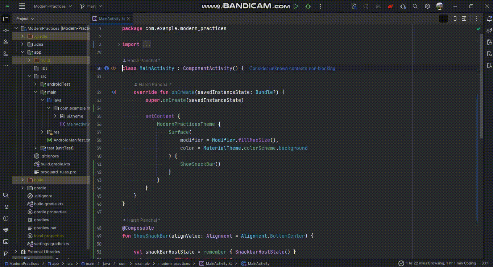

## Jumping Lines - Smoothly Navigate Through Your Code with Ease

_`Introduction:`_
Jumping Lines is a powerful plugin for JetBrains IDEs that allows you to easily navigate through your code by jumping
multiple lines forward or backward with fewer keystrokes than ever. With this plugin, you can easily switch between
different parts of your code, select multiple lines in most easier way, reducing the need to scroll through long files
or navigate through complex codebases.

_`Key Features:`_

1. **Line Jumping:** Jump forward or backward multiple lines at a time.
2. **Line Jumping with selection:** Jump forward or backward multiple lines at a time with selection.
3. **Customizable number of Lines:** Define the number of lines to jump forward and backward through the IDE settings
   dialog.
4. **Jump on Middle line:** Jump on middle line of an editor
5. **Compatible with All JetBrains IDEs:** This plugin is compatible with all JetBrains IDEs, including IntelliJ IDEA,
   PyCharm, Android Studio, PHPStorm, and RubyMine.
6. **Written in Kotlin:** The plugin is entirely written in Kotlin programming language, ensuring a smooth and efficient
   performance.

_`How to Use:`_

1. **Install the plugin:** [Download](https://plugins.jetbrains.com/plugin/22878-jumping-lines) and install the plugin
   from the JetBrains plugin repository or load it from the IDE settings dialog.
2. **Configure the plugin:** Open the IDE settings dialog and navigate to the "Jumping Lines" section to configure the
   number of lines to jump forward and backward.
3. **Start navigating:** Use the shortcut keys <kbd>Ctrl+Shift+Period</kbd> or <kbd>Ctrl+Shift+Comma</kbd> to jump lines
   forward or backward. Use the shortcut keys <kbd>Alt+Shift+Period</kbd> or <kbd>Alt+Shift+Comma</kbd> to jump lines
   forward or backward with selection. Use the shortcut keys <kbd>Ctrl+Comma</kbd> to jump on the middle line of editor.

_`Benefits:`_

1. **Time-Saving:** With Jumping Lines, you can quickly and easily navigate through your code without having to scroll
   through long files or navigate through complex codebases.
2. **Improved Productivity:** By reducing the amount of time spent navigating through code, you can focus on writing
   code and solving problems, leading to increased productivity.
3. **Customizable:** The plugin allows you to define the number of lines to jump forward and backward, giving you
   complete control over your navigation experience.

_`Conclusion:`_
Jumping Lines is a powerful and customizable plugin that simplifies the process of navigating through your code. With
its intuitive interface and efficient performance, you can save time and increase your productivity, making it an
essential tool for any developer. Try it out today and see the difference it can make in your coding experience!  